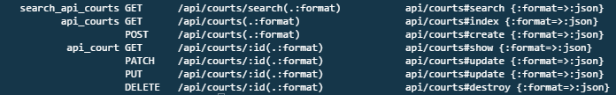

# Swish NYC Basketball Court Finder Web App Backend API

Ruby Version: 2.3.0
Rails Version: 5.0.0.1

NYC Public Parks data pulled from: http://www.nycgovparks.org/bigapps/desc/DPR_Basketball_001.txt

Currently in development and hosted on (Root URL) https://swish-api-srosenshein.c9users.io

API Court Endpoints:

